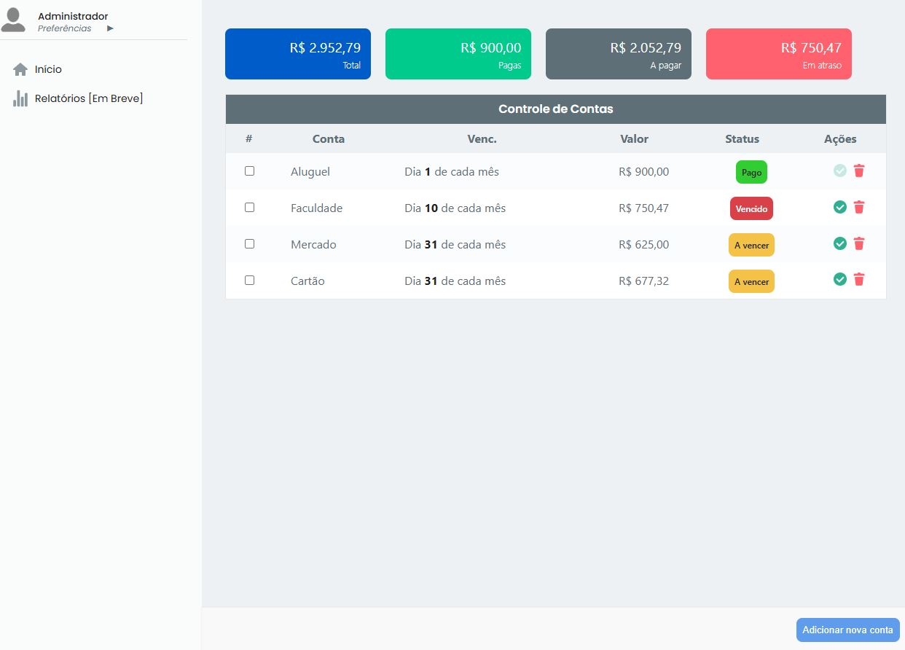

# Título do Projeto

Este projeto tem finalidade de ter um controle e gerenciamento de **Contas a Pagar** mensais.

## Para que serve esse Projeto?

Nesse projeto é possível adicionar contas para ter um controle de pagamento geral, tendo o valor total de contas cadastradas, o que falta para pagar, o que já foi pago e o valor que está em atraso.

## Aprendizados

Nesse projeto, pude praticar mais em ReactJS, tendo uma boa noção sobre componentes, hooks, context API e outros.

## Funcionalidades Atuais e Futuras

- É possível adicionar suas contas para ter um controle total sobre elas.
- É possível usar a versão Desktop e Mobile.
- Relatório com histórico de gastos. _(em desenvolvimento)_

## Instalação

Para utilizar esse projeto, basta realizar o clone desse repositório e instalar suas dependências.

```bash
  git clone https://github.com/PHSalazar/gestao-financeira-reactjs.git
  cd gestao-financeira-reactjs
  npm install
```

## Screenshots

### Versão Desktop




### Versão Mobile


